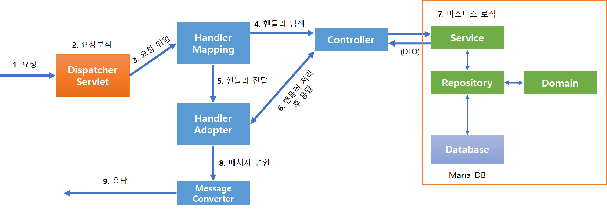

# Asite-Server
> REST에 대한 이해를 위해 REST의 구현원칙을 지키며 최대한 RESTful하게 서버를 구축한다.

### [제작한 REST Docs 문서 바로가기](https://pompitzz.github.io/Asite-Server/)

## 동작 흐름

## 사용 기술
- JAVA
- Gradle
- Spring Boot
- Spring Data JPA
- Spring HATEOAS
- Spring REST Docs
- Spring Security Oauth
- QueryDsl
- ~~AWS S3, EC2, RDS, CodeDeploy~~
- ~~Travis CI~~

---

## REST란?
- REST(Representational State Transfer)는 웹과 같은 분산 하이퍼미디어 시스템에서 사용하는 통신 네트워크 아키텍처이며 REST의 구현 원칙을 제대로 지키는 시스템을 RESTful이라고 할수 있다.

### 구현 원칙
1. 클라이언트 서버
2. 무상태성
3. 캐시 가능
4. 계층화 시스템
5. 코드 온 디멘드(선택 사항)
6. **인터페이스 일관성(Uniform Interface)**

### 인터페이스 일관성
인터페이스 일관성을 유지하기위해선 네가지를 지켜야 한다.
1. 자원 식별
    - api/members/join 과 같이 URI를 통해 리소스를 식별할 수 있어야 한다.
2. 메시지를 통한 리소스 조작
    - 클라이언트는 요청에 서버가 응답에 필요한 정보를 담고 있어야 한다.
3. **자기 서술적 메시지**
    - 메시지 스스로가 메시지에 대한 설명이 가능해야 한다.
    - 서버의 스펙이 변해도 클라이언트는 메시지를 통해 해석이 가능해야 한다.
4. HATEOAS
    - 하이퍼미디어를 통해 애플리케이션의 상태가 변화 가능해야 한다.
    - 응답 메시지에 다음 상태로 전이 가능한 링크 정보들을 담는다.

---

## 엔티티 모델 설계

## 테이블 설계

## 예시
- 자세한 내용은 [REST Docs 문서](https://dongmyeonglee22.github.io/Asite-Server/)를 참조해주세요

### 1. 잘못된 요청
- 클라이언트가 잘못된 요청을 보낼 경우 발생하는 HTTP 요청, 응답 메시지와 응답 메시지를 서술해주는 테이블

 

---

### 2. 토큰 발급
- 클라이언트가 username, password, grant_type와 함께 요청을 보낸 후 사용자가 맞다면 토큰을 발급해주는 HTTP 통신에 대한 요청, 응답 메시지와 요청 응답을 서술해주는 테이블

